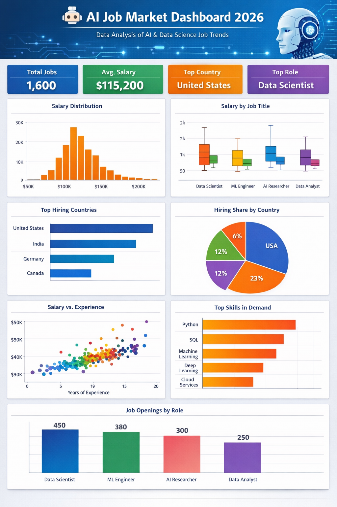

### AI-Job-Market-Trends-2026

An Interactive Streamlit Dashboard for Global AI & Data Science Jobs

### 📌 Overview
---

This project is a fully interactive Streamlit dashboard that analyzes the global AI, Machine Learning, and Data Science job market in 2026.
It provides deep insights into:

- 💰 Salary distribution & role-wise salary comparison
- 🌍 Country-level hiring trends
- 📈 Experience vs salary relationships
- 🛠 Skill demand across AI job roles
- 📌 Job openings by job title
- 🔍 Multi-level filtering across job titles, skills, experience & countries

<h1 align="center">
  
</h1>

  <!-- Project Title Badge -->
  

  <!-- Python -->
  

  <!-- Streamlit -->
  

  <!-- Plotly -->
  

  <!-- Pandas -->
  

  <!-- Status -->
  

  <!-- License -->
  

###🎨 Preview of the badges you will see on GitHub:
---

        

### ⭐ Optional Additional Badges (if you want more)
🔧 Development Badges
---

### 📊 Data Science Badges
---

